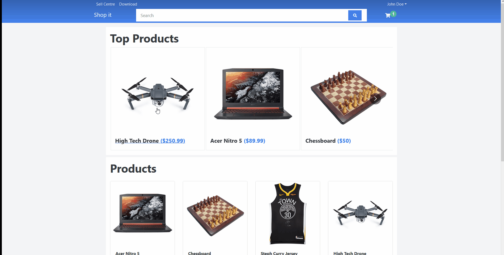

# Shopit

Shopit is a custom ecommerce site built in using Reactjs, Nodejs, & Express.
Check the [sample link](https://shopitapp.herokuapp.com/)



## Installation

If you want to run to your local make sure you have nodejs on your desktop/laptop.

```
npm start #run client side
npm server #run server side
npm dev #run both client and server side
```

## Features

- Auth Login & Register
- Paypal Payment
- Edit Profile
- Add and Edit Cart
- Review and Rate Products
- Add and Edit Admins (Admin)
- Add, Edit & Delete Products (Admin)
- Mark as Delivered Orders (Admin)

## Tech Used

- MongoDB
- Express
- Reactjs
- Nodejs
- JWT auth
- Redux (State Management)
- Bcryptjs
- React-Bootstrap
- React Multi Carousel
- React Paypal
- Multer
